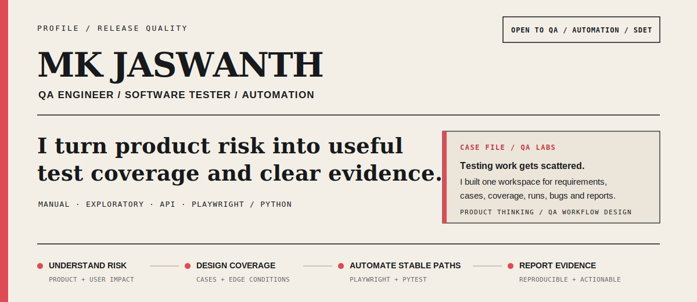

# MK Jaswanth

**QA Engineer · Software Tester · Python and Playwright Automation**

<a href="https://mkjaswanth.github.io/portfolio/"><kbd>Portfolio ↗</kbd></a> <a href="https://www.linkedin.com/in/mkjaswanth/"><kbd>LinkedIn ↗</kbd></a> <a href="mailto:jaswanth.mk63@gmail.com"><kbd>Email</kbd></a>

I test web and mobile products through exploratory, functional, regression, and API testing. For repeatable browser coverage, I build automation with Python, Playwright, pytest, and the Page Object Model.

I work close to the product: understanding what can fail, turning requirements into useful coverage, and reporting defects with enough evidence for a team to act. I am open to QA Engineer, Automation Tester, and SDET opportunities.

## QA Labs — built to fix a testing workflow

> **Problem** — Test information gets scattered across spreadsheets, messages, and disconnected tools.
>
> **Build** — I created one test-management workspace for projects, requirements, test cases, coverage, plans, runs, defects, reports, activity history, and backups.
>
> **Why it matters** — QA Labs combines product definition, practical QA workflow design, and implementation around a problem I have encountered in day-to-day testing.

<a href="https://qa-labs-seven.vercel.app/"><kbd>Open QA Labs ↗</kbd></a> <a href="https://github.com/MKJaswanth/QA-labs"><kbd>View Source ↗</kbd></a>

## Selected evidence

Across 4+ projects—including e-commerce and LMS products—I have designed 200+ test cases per project.

| Work | What it demonstrates |
| --- | --- |
| **[E-commerce Automation ↗](https://github.com/MKJaswanth/E-commerce_automation)** | Playwright and pytest coverage for authentication, inventory, cart, and checkout using page objects, fixtures, parameterization, HTML reports, environment configuration, and GitHub Actions. |
| **[Playwright Pytest QA Skill ↗](https://github.com/MKJaswanth/playwright-pytest-qa-skill)** | A reusable workflow for designing, running, and reporting browser tests with Playwright and pytest. |
| **[QA Portfolio ↗](https://mkjaswanth.github.io/portfolio/)** | Longer-form project context, testing work, and the decisions behind the work. [Source ↗](https://github.com/MKJaswanth/portfolio). |
| **[BugAuraLabs ↗](https://bugauralabs.studio/)** | A QA services site explaining testing scope, defect reporting, and engagement options for product teams. [Source ↗](https://github.com/MKJaswanth/BugAuraLabs). |

**[Browse all repositories and contribution activity ↗](https://github.com/MKJaswanth?tab=overview)**

## Working toolkit

**Testing:** Manual, exploratory, functional, regression, API, test design, defect lifecycle

**Automation:** Python, Playwright, pytest, Page Object Model, fixtures, data-driven testing

**Delivery:** Git, GitHub Actions, CI/CD, Jira, Postman

**Foundations:** SQL, HTML, CSS, JavaScript, AI-assisted testing

## Quality approach

- Understand the product and user risk before selecting coverage.
- Explore first, then automate stable paths that benefit from repetition.
- Report failures with clear steps, environment details, expected behavior, actual behavior, and supporting evidence.

## Outside QA

Away from testing, I spend time listening to music, travelling, and reading. They keep me curious about how people use products and solve everyday problems.

For QA Engineer, Automation Tester, or SDET opportunities: <a href="https://www.linkedin.com/in/mkjaswanth/"><kbd>LinkedIn ↗</kbd></a> <a href="mailto:jaswanth.mk63@gmail.com"><kbd>Email</kbd></a>
