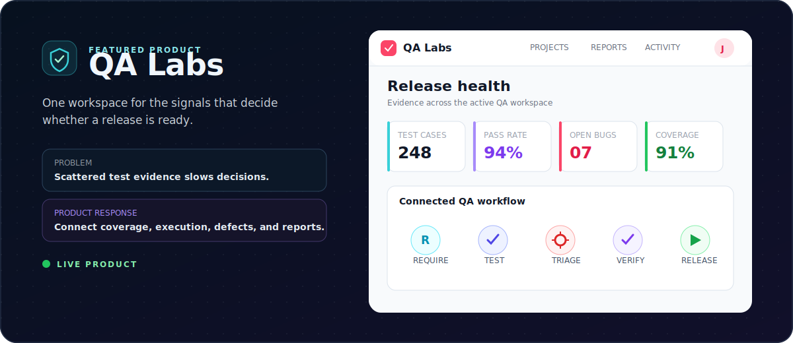

<div align="center">
  

  <a href="https://readme-typing-svg.demolab.com">
    
  </a>

  <p>
    <a href="https://mkjaswanth.github.io/portfolio/"></a>
    <a href="https://www.linkedin.com/in/mkjaswanth/"></a>
    <a href="mailto:jaswanth.mk63@gmail.com"></a>
  </p>

  <p>
    
    
    
  </p>
</div>

## `whoami`

I am a QA engineer who likes to stay close to the product—not just the test cases. I combine **exploratory thinking, structured manual testing, API validation, and browser automation** to find meaningful risks and make releases easier to trust.

I also build QA tools. My flagship project, **QA Labs**, started from a simple problem: test knowledge becomes scattered across sheets, chats, and disconnected tools. I am turning that workflow into one focused quality workspace.

```text
Current signal
├── Building     QA Labs — test management software for practical QA teams
├── Testing      E-commerce, LMS, and web-product workflows
├── Evidence     4+ projects with 200+ designed test cases per project
├── Automating   Playwright + Python + pytest + Page Object Model
└── Exploring    QA Engineer · Automation Tester · SDET opportunities
```

## Featured build · QA Labs

<a href="https://qa-labs-seven.vercel.app/">
  
</a>

<table>
  <tr>
    <td width="50%" valign="top">
      <h3>The problem</h3>
      <p>Requirements, test cases, runs, bugs, and release signals often live in different places. That makes coverage difficult to understand and decisions slower to make.</p>
    </td>
    <td width="50%" valign="top">
      <h3>What I built</h3>
      <p>A focused test-management product that brings projects, requirements, coverage, execution, defects, reports, activity, and backups into one QA workflow.</p>
    </td>
  </tr>
</table>

<p align="center">
  <a href="https://qa-labs-seven.vercel.app/"></a>
  <a href="https://github.com/MKJaswanth/QA-labs"></a>
</p>

## Selected work

| Project | What it demonstrates | Explore |
|:--|:--|:--:|
| **Portfolio · QA Command Center** | A recruiter-focused portfolio built around product risk, test evidence, and release confidence. | [Live](https://mkjaswanth.github.io/portfolio/) · [Code](https://github.com/MKJaswanth/portfolio) |
| **E-commerce Automation** | Maintainable browser checks using Playwright, Python, pytest, fixtures, POM, reporting, and CI-aware execution. | [Repository](https://github.com/MKJaswanth/E-commerce_automation) |
| **Playwright Pytest QA Skill** | A reusable QA automation workflow for designing, running, and reporting Playwright tests with pytest. | [Repository](https://github.com/MKJaswanth/playwright-pytest-qa-skill) |
| **BugAuraLabs** | A product-style company profile for a QA services brand, connecting testing expertise with clear client communication. | [Website](https://bugauralabs.studio) · [Code](https://github.com/MKJaswanth/BugAuraLabs) |

## Quality engineering toolkit

<details open>
  <summary><b>Testing & quality practice</b></summary>
  <br />
  <p>
    
    
    
    
    
    
    
  </p>
</details>

<details open>
  <summary><b>Automation & delivery</b></summary>
  <br />
  <p>
    
    
    
    
    
    
    
  </p>
</details>

<details>
  <summary><b>Product & technical foundations</b></summary>
  <br />
  <p>
    
    
    
    
    
    
    
  </p>
</details>

## How I approach quality

| 01 · Understand risk | 02 · Explore before automating |
|:--|:--|
| I connect requirements to user impact and failure risk before deciding what to test. | Manual exploration finds the unknowns; automation protects the stable, valuable paths. |

| 03 · Make failures useful | 04 · Build quality into delivery |
|:--|:--|
| A good defect is reproducible, prioritized, and supported by evidence that helps the team act. | Quality is a shared product responsibility and a continuous signal—not a final gate. |

## GitHub signal

<p align="center">
  
  
</p>

<p align="center">
  
</p>

<p align="center">
  
</p>

## The QA release maze

<p align="center"><i>Quality is rarely a straight line. The signal still has to reach release.</i></p>



<p align="center"><sub>Generated weekly by <code>.github/workflows/maze.yml</code>.</sub></p>

## Beyond the test environment

When I am not investigating a failure or improving a workflow, you will usually find me:

- 🎧 discovering music and replaying the tracks that pass every regression cycle;
- 🧭 travelling, observing how different places and people solve everyday problems;
- 📚 reading to collect new perspectives—technical and otherwise.

## Let’s build something reliable

If you are hiring for **QA Engineer, Automation Tester, or SDET roles**, or want to talk about testing systems and product quality, I would be glad to connect.

<p align="center">
  <a href="https://mkjaswanth.github.io/portfolio/"></a>
  <a href="https://www.linkedin.com/in/mkjaswanth/"></a>
  <a href="mailto:jaswanth.mk63@gmail.com"></a>
</p>

<p align="center"><b>Test thoughtfully. Automate intentionally. Release confidently.</b></p>
